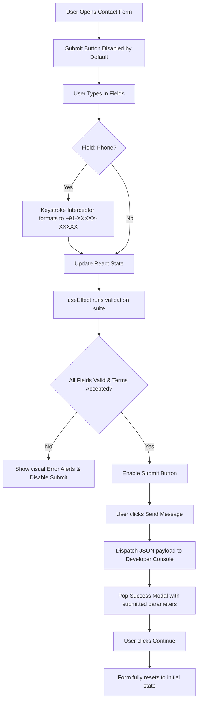
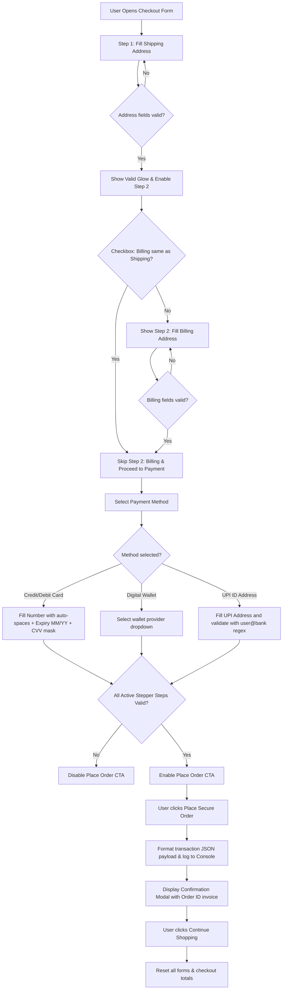

# Master Workspace Documentation: Advanced React Forms System

Welcome to the unified documentation workspace for **Assignment 1** and **Assignment 2** located at `c:\Users\T490\OneDrive\Pictures\form`. Both projects are scaffolded using **Vite + React (JS)**, featuring high-fidelity dark glassmorphic styles, custom form controllers, real-time keyboard interceptors, and strict validation systems with zero external form libraries (e.g. Formik or react-hook-form) to ensure maximum educational clarity.

---

## 📖 Table of Contents
1. [System Architecture (MVVM)](#-system-architecture-mvvm)
2. [Assignment 1: Advanced Contact Form](#-assignment-1-advanced-contact-form)
   * [Visual UI Design Spec](#visual-ui-design-spec)
   * [Functional Controller Flow (Mermaid Diagram)](#functional-controller-flow-mermaid-diagram)
   * [File Explanations & Key Roles](#file-explanations--key-roles)
   * [Validation Registry Spec](#validation-registry-spec)
3. [Assignment 2: Secure E-Commerce Checkout Form](#-assignment-2-secure-e-commerce-checkout-form)
   * [E-Commerce Stepper Speclist](#e-commerce-stepper-speclist)
   * [Functional Checkout Flow (Mermaid Diagram)](#functional-checkout-flow-mermaid-diagram)
   * [File Explanations & Reusability Specs](#file-explanations--reusability-specs)
   * [Dynamic Formatting & RegEx Validation Spec](#dynamic-formatting--regex-validation-spec)
4. [Setup & Running Locally](#-setup--running-locally)

---

## 🏗️ System Architecture (MVVM)

Both assignments are designed using the **MVVM (Model-View-ViewModel)** architectural pattern. By separating rendering files (Views) from computational states and validators (Controllers), the projects remain modular, testable, and clean.

```
+------------------------------------+
|               VIEW                 |
|  (App.jsx & src/components/*)      |
+------------------------------------+
                 |
        Listens to user input
        Triggers handler callbacks
                 |
                 v
+------------------------------------+
|            VIEWMODEL               |
|      (src/hooks/use*.js)           |
+------------------------------------+
                 |
        Runs keystroke interceptors
        Applies input formatting
        Triggers validation effects
                 |
                 v
+------------------------------------+
|               MODEL                |
|      (JSON Payload Output)         |
+------------------------------------+
```

---

## 🛡️ Assignment 1: Advanced Contact Form

A premium glassmorphic single-panel communication portal designed for secure data collection, built inside `/ass-1`.

### Visual UI Design Spec
*   **Frosted Panels**: Configured via CSS `backdrop-filter: blur(20px)` and semi-translucent dark border boundaries.
*   **Ambient Glows**: Three absolute-positioned canvas glow circles that float slowly across the background using infinite keyframe translations.
*   **Neon Status Cues**: Form input fields glow **neon green** when valid and **crimson red** when touched and invalid.

### Functional Controller Flow (Mermaid Diagram)




### File Explanations & Key Roles

*   [`ass-1/index.html`](file:///c:/Users/T490/OneDrive/Pictures/form/ass-1/index.html): Custom HTML5 header structure including mobile-friendly viewports, SEO search descriptions, and custom emoji SVG favicons.
*   [`ass-1/src/main.jsx`](file:///c:/Users/T490/OneDrive/Pictures/form/ass-1/src/main.jsx): React entry point that binds the master component structure to the root element.
*   [`ass-1/src/index.css`](file:///c:/Users/T490/OneDrive/Pictures/form/ass-1/src/index.css): Master style definitions enclosing drifting `@keyframes`, visual glass cards, input rings, and checkbox check animation keyframes.
*   [`ass-1/src/App.jsx`](file:///c:/Users/T490/OneDrive/Pictures/form/ass-1/src/App.jsx): The declarative View Layer. It binds state attributes and event-handlers directly from the custom hook into the subcomponents.
*   [`ass-1/src/hooks/useContactForm.js`](file:///c:/Users/T490/OneDrive/Pictures/form/ass-1/src/hooks/useContactForm.js): **The Controller.** Holds states (`formData`, `touched`, `errors`), triggers standard email domain logic, validates conditions, manages the Indian phone formatter, and returns control variables.
*   **`ass-1/src/components/` (UI Subcomponents)**:
    *   [`GlowBackground.jsx`](file:///c:/Users/T490/OneDrive/Pictures/form/ass-1/src/components/GlowBackground.jsx): Isolates background visual effects.
    *   [`InputField.jsx`](file:///c:/Users/T490/OneDrive/Pictures/form/ass-1/src/components/InputField.jsx): Custom inputs (supporting full text, phone formats, and email addresses) with validation checks.
    *   [`TextAreaField.jsx`](file:///c:/Users/T490/OneDrive/Pictures/form/ass-1/src/components/TextAreaField.jsx): Text message fields with character boundaries and live length indicators.
    *   [`SelectField.jsx`](file:///c:/Users/T490/OneDrive/Pictures/form/ass-1/src/components/SelectField.jsx): Custom priority dropdown selectors with custom chevron rotation triggers.
    *   [`CheckboxField.jsx`](file:///c:/Users/T490/OneDrive/Pictures/form/ass-1/src/components/CheckboxField.jsx): Custom checkboxes for terms and optional newsletter agreements.
    *   [`SuccessModal.jsx`](file:///c:/Users/T490/OneDrive/Pictures/form/ass-1/src/components/SuccessModal.jsx): Translucent glass success receipt panel with scale and slide transitions.

### Validation Registry Spec
*   **Full Name**: String length `[3, 50]`. Must only contain letters and spacing (`/^[a-zA-Z\s]+$/`).
*   **Email Address**: RFC 5322 regex validation. **Fully supports personal Gmail accounts (`@gmail.com`)** alongside standard business domains.
*   **Phone Number**: Strictly validates against the Indian standard mask: `+91-XXXXX-XXXXX`. Non-digits are removed, and a formatting mask is auto-applied as the user types.
*   **Subject**: Enforces a minimum length of 5 characters and restricts total word count to 100.
*   **Message**: Live text counter. Enforces character boundary limits of `[20, 500]`.
*   **Terms Agreement**: Must be selected (Boolean `true`) to enable form submission.

---

## 🛒 Assignment 2: Secure E-Commerce Checkout Form

A multi-step checkout form designed with a split e-commerce interface, sticky order calculations, and sensitive credit card formatters, built inside `/ass-2`.

### E-Commerce Stepper Speclist
*   **Flexible Stepper**: Evaluates input fields per step dynamically.
*   **DRY Address Grid**: Uses a single custom address component mapped to different state prefixes (`shipping` and `billing`) to keep the code highly modular.
*   **Sticky Summary Sidebar**: A persistent shopping cart displaying item breakdowns, subtotal logic, promo coupon calculations (`GLASSY15`, `-15%`), and shipping rates.

### Functional Checkout Flow (Mermaid Diagram)




### File Explanations & Reusability Specs

*   [`ass-2/index.html`](file:///c:/Users/T490/OneDrive/Pictures/form/ass-2/index.html): Root viewport HTML layout incorporating secure cart favicons.
*   [`ass-2/src/main.jsx`](file:///c:/Users/T490/OneDrive/Pictures/form/ass-2/src/main.jsx): Binds the e-commerce root element.
*   [`ass-2/src/index.css`](file:///c:/Users/T490/OneDrive/Pictures/form/ass-2/src/index.css): Formats the split e-commerce grid, active visual steppers, and sticky totals sidebar (`.order-summary-sticky`).
*   [`ass-2/src/App.jsx`](file:///c:/Users/T490/OneDrive/Pictures/form/ass-2/src/App.jsx): declarative View Layout displaying header banners, column configurations, and modular stepper grids.
*   [`ass-2/src/hooks/useCheckoutForm.js`](file:///c:/Users/T490/OneDrive/Pictures/form/ass-2/src/hooks/useCheckoutForm.js): **The Controller.** Manages e-commerce calculations, payment method states, custom formatters, dynamic step validations, and success handlers.
*   **`ass-2/src/components/` (UI Subcomponents)**:
    *   [`GlowBackground.jsx`](file:///c:/Users/T490/OneDrive/Pictures/form/ass-2/src/components/GlowBackground.jsx): Isolates background visual effects.
    *   [`AddressSection.jsx`](file:///c:/Users/T490/OneDrive/Pictures/form/ass-2/src/components/AddressSection.jsx): **A highly reusable address block**. Using a `prefix` parameter (e.g. `'shipping'` or `'billing'`), this single component handles the entire input layout and validation borders for both shipping and conditional billing address cards.
    *   [`PaymentSection.jsx`](file:///c:/Users/T490/OneDrive/Pictures/form/ass-2/src/components/PaymentSection.jsx): Groups credit/debit card, wallet, and UPI selectors. Handles card number formatting (`XXXX XXXX XXXX XXXX`) and automatic expiry slashes (`MM/YY`).
    *   [`OrderSummary.jsx`](file:///c:/Users/T490/OneDrive/Pictures/form/ass-2/src/components/OrderSummary.jsx): A sticky sidebar computing product subtotal additions, promotional coupon deductions (`GLASSY15`, `-15%`), shipping charges, and checkout button triggers.
    *   [`ConfirmationModal.jsx`](file:///c:/Users/T490/OneDrive/Pictures/form/ass-2/src/components/ConfirmationModal.jsx): Confirms order placement with randomized transaction Order IDs.

### Dynamic Formatting & RegEx Validation Spec
*   **Gmail Support**: The email field validation natively allows standard email patterns (such as `username@gmail.com`).
*   **Indian Phone Numbers**: Strict validation requiring exactly 10 digits starting with `6-9` (`/^[6-9]\d{9}$/`).
*   **Postal Pincode**: Strict 6-digit validator matching the Indian PIN standard (`/^[1-9][0-9]{5}$/`).
*   **Credit Card Number Formatter**: Keystroke interceptor strips non-numeric characters and inserts a space after every 4 digits, ensuring card values display as `XXXX XXXX XXXX XXXX` in React state.
*   **Card Expiry Formatter**: Intercepts input to insert a forward slash (`MM/YY`) when the third character is entered. It validates that the month is in the range `[01, 12]` and the year is a valid future date (`YY` from `26` to `99`).
*   **Card CVV**: Masks CVV inputs and enforces exactly 3 digits.
*   **UPI ID Verification**: Verifies addresses against standard formatting patterns (e.g. `username@bank`).

---

## 🚀 Setup & Running Locally

### Dependencies Prerequisites
Ensure you have **Node.js (version 18+)** installed.

### Installation Runbook

Install all node dependencies inside each project folder. The dependencies include `react`, `react-dom`, `lucide-react` icons, and development tools like `vite`.

```powershell
# Install Assignment 1 Dependencies
cd ass-1
npm install

# Install Assignment 2 Dependencies
cd ../ass-2
npm install
```

### Starting Development Server

To launch the local development servers, run the `npm run dev` script in the respective project folder:

```powershell
# Run Assignment 1 (starts on http://localhost:5173/)
cd ass-1
npm run dev

# Run Assignment 2 (starts on http://localhost:5173/ or subsequent port)
cd ../ass-2
npm run dev
```

### Compiling Production Bundle

To build the static assets for deployment, run the compile script in the respective project folder:

```powershell
cd ass-1
npm run build   # Outputs compiled HTML, CSS, and JS to the /dist folder

cd ../ass-2
npm run build   # Outputs compiled checkout assets to the /dist folder
```
